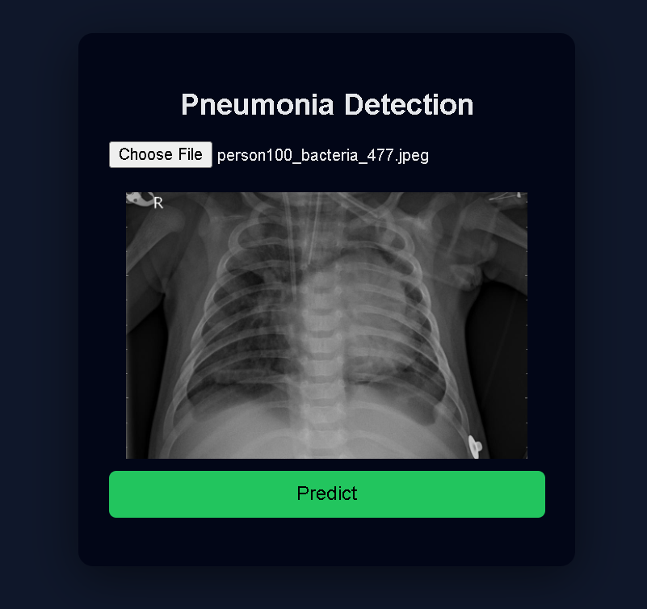
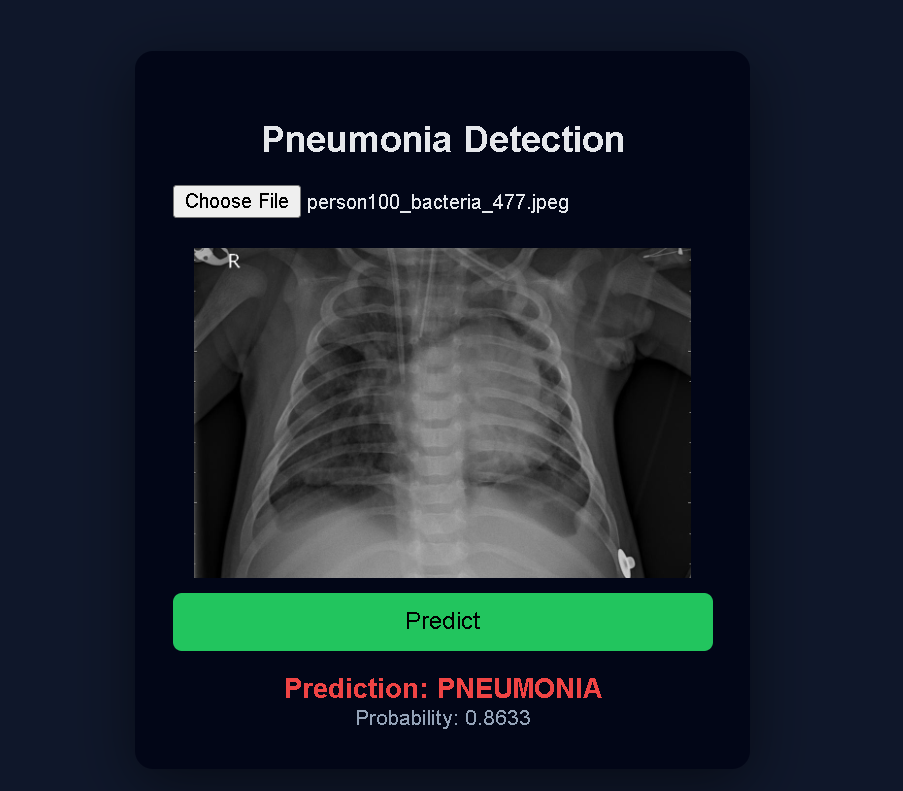
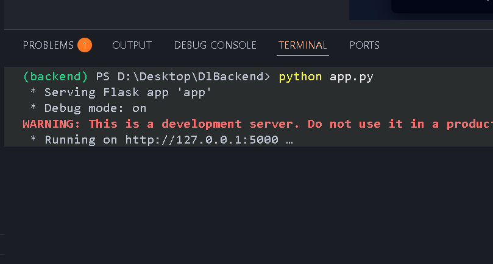

# Pneumonia Detection System (CNN)

End-to-end deep learning project for detecting **Pneumonia from Chest X-ray images** using a **Convolutional Neural Network (CNN)**.  
Includes model training, evaluation, threshold tuning, Flask API, and frontend integration.

> ⚠️ Educational use only. Not for medical diagnosis.

---

## Project Structure

pneumonia-detection-system/
│
├── app.py # Flask backend
├── frontend/
│ └── index.html # Frontend UI
├── model_cnn.ipynb # Model training notebook
├── pneumonia_model.keras # Trained model (not tracked in git)
├── README.md
└── .gitignore


---

## Dataset

- **Name:** Chest X-Ray Images (Pneumonia)
- **Source:** Kaggle
- **Author:** Paul Mooney
- **Classes:** NORMAL, PNEUMONIA
- **Input Size:** `(224, 224, 3)`

---

## Model Architecture

```python
model = Sequential([
    Conv2D(32, (3,3), activation='relu', input_shape=(224,224,3), use_bias=False),
    BatchNormalization(),
    MaxPooling2D(2,2),

    Conv2D(64, (3,3), activation='relu', use_bias=False),
    BatchNormalization(),
    MaxPooling2D(2,2),

    Conv2D(128, (3,3), activation='relu', use_bias=False),
    BatchNormalization(),
    MaxPooling2D(2,2),

    Flatten(),
    Dense(128, activation='relu'),
    Dropout(0.5),
    Dense(1, activation='sigmoid')
])

# Test set evaluation
model.evaluate(test_data)
Loss: 0.2868
Accuracy: 86.86%
Recall: 96.15%
```

## Screenshots

### Upload Image


### Prediction Result


### Backend Running


## Backend (Flask API)

The backend is built using **Flask** and serves the trained CNN model for inference.


